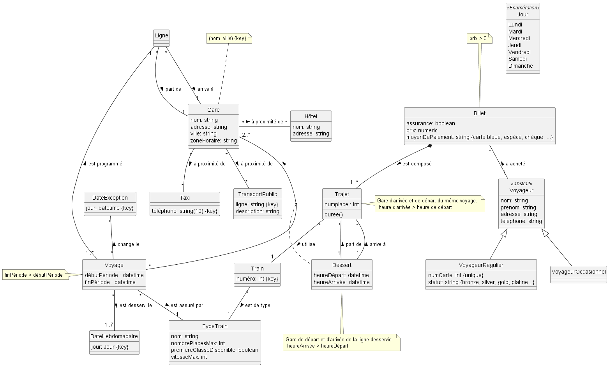

# Note de clarification du schéma UML
# D4_G3 - Gestion des trains

## Gare : 

    nom, adresse, ville, zoneHoraire 
    (nom, adresse) = clé

    => à proximité de Hôtel (* - *)
    => à proximité de Taxi (* - *)
    => à proximité de TransportPublic (* - *)
    
## Ligne :  

    => part de Gare (* - 1)
    => arrive à Gare (* - 1)

## Voyage : 

    débutPériode, finPériode (finPériode > débutPériode)

    => est programmé sur Ligne (1..* - 1)
    => dessert la Gare (* - 2..*)
    => est assuré par TypeTrain (* - 1)
    => est desservi le DateHebdomadaire (* - 1..7)
    => change le DateException (* - *)

## DateException : 

    jour (clé)

## DateHebdomadaire : 

    jour (clé)

## Dessert : 

    heureDépart, heureArrivée (heureArrivée > heureDépart)

    Table d'association entre Voyage et Gare, qui contient les gares d'un voyage avec l'heure d'arrivée et de départ.
    Elle doit contenir pour chaque voyage au minimum la gare de départ et le terminus de la ligne associé au voyage.

## Train : 

    numéro (clé)

    => est de type TypeTrain (* - 1)

## TypeTrain : 

    nom, nombrePlacesMax, premièreClasseDisponible, vitesseMax

## Hôtel : 

    nom, adresse

## Taxi : 

    téléphone (clé)

## TransportPublic : 

    ligne (clé), description

## Billet : 

    assurance, prix (>0), moyenDePaiement

    => est composé de Trajet (1 - 1..*) (association de composition)
    
## Trajet : 

    numplace, durée() ( méthode calculant la durée)

    => utilise Train (* - 1)
    => part de Dessert (* - 1)
    => arrive à Dessert (* - 1)

    Récupère deux gares d'un même voyage avec les heures. Il faut que l'heure de départ < l'heure d'arrivée.

## Voyageur : 

    nom, prénom, adresse, téléphone

    => a acheté Billet (1 - *)
    
### VoyageurOccasionnel

### VoyageurRegulier : 

    numCarte (clé), statut

    Il y a une relation d'héritage exclusif entre VoyageurOccasionnel, VoyageurRegulier et Voyageur qui est asbtrait.

## [Lien du schéma PlantUML](./UML.plantuml)

## 

## Fait par Louka CHAPIRO, Jieni YU, Mohamed TAHIRI et Soulaymane KEBLI.

